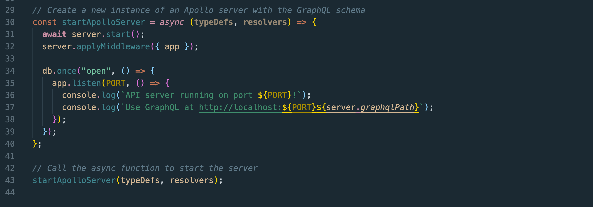
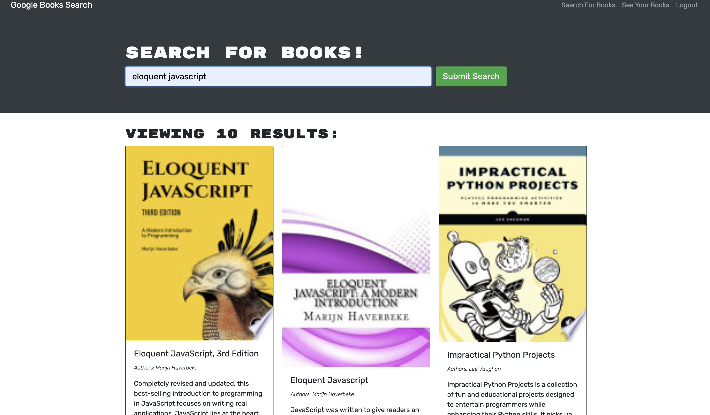
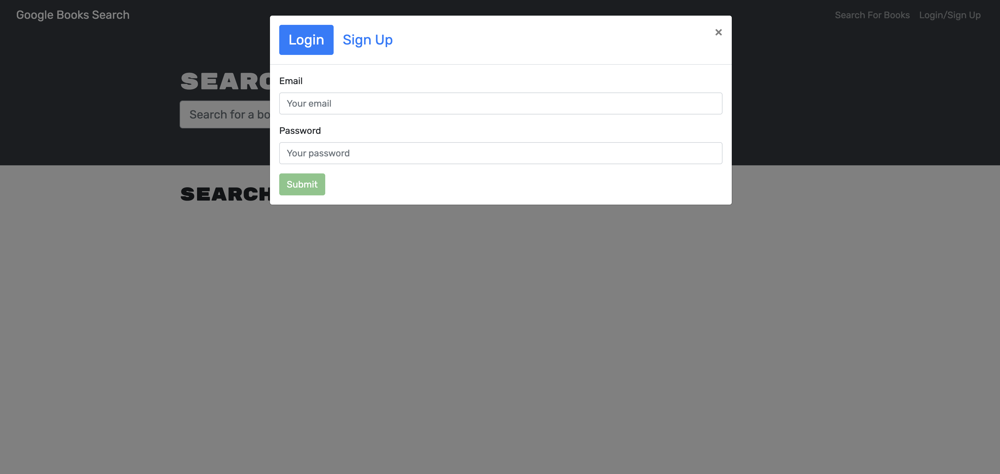
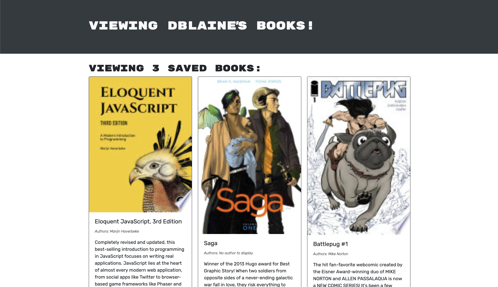

# 21: "Booklooker" GQL code refactor

#### Licensed under [MIT](LICENSE)

## Table of Contents

- [Project Description](#project-description)
- [Usage](#usage-instructions)
- [Tests](#tests)
- [Links](#links)

## Project Description

This website features a simple book search engine where users can search for books, and create an account to save books to their personal profile for later reference. Utilizes MERN stack.

This application originally featured a Google Books API search engine built with a RESTful API, but has been refactored to utilize a GraphQL API with an Apollo server.

## Usage Instructions

Click the Heroku link below to open Booklooker in your browser, and get to searching for your next book!

Create an account to save your favorite books to your profile.

## Tests

Start the server locally by entering <code>npm run develop</code>. Visit the GQL playground at <code>localhost:3001</code> to test the various routes used to Get, Post, and Delete items

## Links

- Repository: https://github.com/Sarahlophus/booklooker
- Live page (Heroku): https://looking4books.herokuapp.com/
